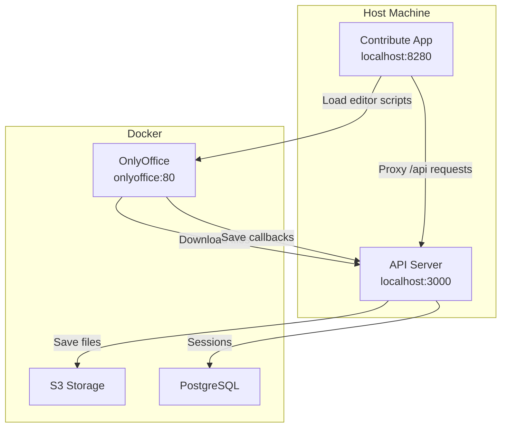
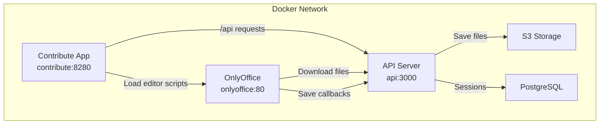

# OnlyOffice Slide Editor Integration

This document explains the OnlyOffice Document Server integration for the BLMS Contribute app's slide translation feature.

## Overview

The OnlyOffice slide editor allows translators to edit PowerPoint presentations directly in the browser with full fidelity. The integration supports:

- Real-time collaborative editing of PPTX files
- Manual save functionality with validation workflow
- Seamless file synchronization with S3 storage
- Cross-environment compatibility (hybrid development + production)

## Architecture

### Development Environment (Hybrid)

In the hybrid development setup:
- **Contribute App**: Running on host at `localhost:8280`
- **API Server**: Running on host at `localhost:3000`
- **OnlyOffice**: Running in Docker container (port 80)
- **Database/S3**: Running in Docker containers



### Production Environment (Full Docker)

In production, all services run in Docker:



## File Flow & Save Process

### 1. File Loading
```
User clicks "Edit Slide"
    → Frontend requests PPTX file via /api/translation-downloads/pptx/{courseId}/{slideId}/{language}
    → API streams file from S3
    → OnlyOffice loads file for editing
```

### 2. Manual Save Process
```
User clicks "Validate Presentation"
    → Frontend calls onlyOfficeEditorRef.current.saveDocument()
    → Sends forcesave command via /api/translation-downloads/pptx-forcesave
    → API forwards command to OnlyOffice CommandService
    → OnlyOffice saves document and calls back API
    → API receives saved document and uploads to S3
    → Database updated with validation status
```

## Key Components

### Frontend (`onlyoffice-slide-editor.tsx`)

**Environment Detection:**
```typescript
const isHybridDev = window.location.hostname === 'localhost';
const apiHost = isHybridDev ? 'host.docker.internal:3000' : 'api:3000';
```

**Manual Save Implementation:**
```typescript
const saveDocument = async () => {
  const documentKey = btoa(fileUrl!).replace(/[^a-zA-Z0-9]/g, '');
  const response = await fetch('/api/translation-downloads/pptx-forcesave', {
    method: 'POST',
    headers: { 'Content-Type': 'application/json' },
    body: JSON.stringify({ documentKey, courseId, slideId, language }),
    credentials: 'include'
  });
};
```

### Backend API Routes

**Force Save Proxy:** `/api/translation-downloads/pptx-forcesave`
- Accepts manual save requests from frontend
- Forwards forcesave commands to OnlyOffice
- Handles environment-specific OnlyOffice URLs

**File Download:** `/api/translation-downloads/pptx-public/{courseId}/{slideId}/{language}`
- Public endpoint for OnlyOffice to download files
- No authentication required (OnlyOffice can't handle auth headers)
- Streams files directly from S3

**Save Callback:** `/api/translation-downloads/pptx-callback`
- Receives saved documents from OnlyOffice
- Uploads updated files to S3
- Updates database validation status

## Environment Configuration

### Development (Hybrid)

**Vite Proxy Configuration:**
```typescript
// vite.config.ts
server: {
  proxy: {
    '/api': `http://${process.env.DOCKER ? 'api' : 'localhost'}:3000`,
    '/web-apps': {
      target: `http://${process.env.DOCKER ? 'onlyoffice' : 'localhost'}`,
      changeOrigin: true,
    },
  },
}
```

**Session Configuration:**
```typescript
// Development session settings
domain: 'localhost',           // Allow cross-port cookies
sameSite: 'lax',              // Allow cross-port requests
secure: false                 // HTTP in development
```

### Production (Full Docker)

**Environment Variables:**
```bash
DOCKER=true                   # Enables Docker service names
DOMAIN=yourdomain.com         # Production domain
SESSION_SECRET=secure-secret  # Secure session secret
```

**Session Configuration:**
```typescript
// Production session settings
domain: 'yourdomain.com',     // Proper domain
sameSite: 'strict',           // Secure cookies
secure: true                  // HTTPS in production
```

## Security Considerations

### Authentication Flow
1. User must be authenticated via session cookies
2. Manual save requests require valid session
3. Public download endpoint has no auth (OnlyOffice limitation)
4. File access is controlled by course/slide permissions

### Session Management
- **Development**: Relaxed settings for cross-port development
- **Production**: Strict settings for security
- Sessions stored in PostgreSQL with expiration
- Automatic cleanup of expired sessions

## Troubleshooting

### Common Issues

**1. 401 Unauthorized on Manual Save**
- Check if user is logged in
- Verify session cookies are being sent
- Restart API server after session config changes

**2. OnlyOffice Can't Load Files**
- Verify file exists in S3
- Check OnlyOffice can reach API server
- Ensure correct hostname resolution (host.docker.internal vs service names)

**3. Manual Save Not Working**
- Check OnlyOffice container is running
- Verify forcesave command reaches OnlyOffice
- Check callback URL is accessible from OnlyOffice

**4. Files Not Saving to S3**
- Verify S3 credentials and permissions
- Check callback handler receives documents
- Ensure proper error handling and logging

### Development Debugging

**Check API Logs:**
```bash
# API server should log all requests
[request] abc123 POST /api/translation-downloads/pptx-forcesave
```

**Check OnlyOffice Logs:**
```bash
docker logs onlyoffice
```

**Check Network Connectivity:**
```bash
# From OnlyOffice container to API
docker exec onlyoffice curl http://host.docker.internal:3000/api/health

# From API to OnlyOffice
curl http://localhost:80/coauthoring/CommandService.ashx
```

## File Structure

```
apps/contribute/src/components/translation/
├── onlyoffice-slide-editor.tsx    # Main editor component
├── ppt-link.tsx                   # Download/validation UI
└── transcription-editor.tsx       # Text transcription editor

apps/api/src/routers/rest/
└── translation-downloads.ts       # File download & save endpoints
```

## Configuration Requirements

### OnlyOffice Container

```yaml
onlyoffice:
  image: onlyoffice/documentserver:latest
  environment:
    - JWT_ENABLED=false              # Disable JWT for development
    - USE_UNAUTHORIZED_STORAGE=true  # Allow public file access
    - ALLOW_PRIVATE_IP_ADDRESS=true  # Allow localhost connections
    - ALLOW_HTTP_REQUEST_TO_EDIT_DOCUMENT=true
  extra_hosts:
    - "host.docker.internal:host-gateway"  # Enable host access
```

### API Server

```typescript
// Required environment detection
const isDocker = process.env.DOCKER === 'true';
const onlyofficeUrl = isDocker
  ? 'http://onlyoffice/coauthoring/CommandService.ashx'
  : 'http://localhost:80/coauthoring/CommandService.ashx';
```

## Production Deployment

### Checklist

- [ ] Set `DOCKER=true` environment variable
- [ ] Configure proper domain for session cookies
- [ ] Enable JWT for OnlyOffice in production
- [ ] Use secure session secrets
- [ ] Verify all service names match docker-compose.yml
- [ ] Test file upload/download permissions
- [ ] Verify HTTPS configuration
- [ ] Test manual save workflow end-to-end

### Security Hardening

```yaml
# Production OnlyOffice configuration
onlyoffice:
  environment:
    - JWT_ENABLED=true
    - JWT_SECRET=${ONLYOFFICE_JWT_SECRET}
    - USE_UNAUTHORIZED_STORAGE=false
    - WOPI_ENABLED=false
```

## Performance Considerations

- **File Size Limits**: Configure appropriate limits for PPTX uploads
- **Timeout Settings**: Adjust OnlyOffice timeouts for large files
- **Connection Pooling**: Use connection pooling for database sessions
- **Caching**: Consider caching frequently accessed files
- **CDN**: Use CDN for OnlyOffice static assets in production

## Future Improvements

1. **Real-time Collaboration**: Enable multiple users editing simultaneously
2. **Version History**: Track document versions and changes
3. **Auto-save**: Implement periodic auto-save functionality
4. **Offline Support**: Allow editing when network is unavailable
5. **Mobile Support**: Optimize editor for mobile devices
6. **Performance Monitoring**: Add metrics for editor loading times
