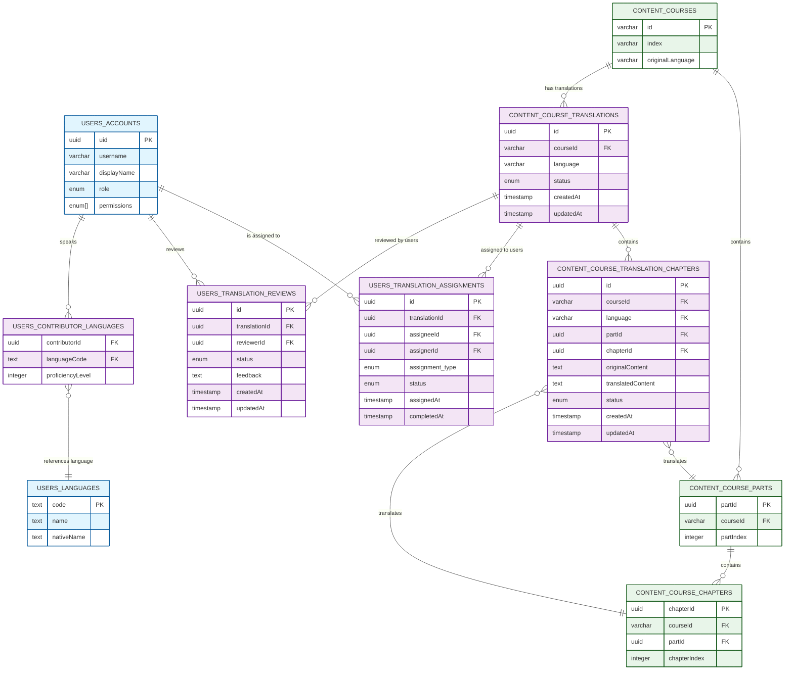
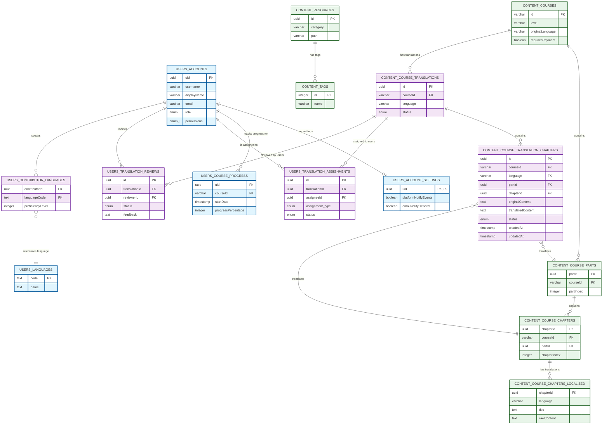

# Contribute App Data Architecture: Course Translation and Review System

This document details the database schema extensions required to support the course translation and review system within the Bitcoin Learning Management System (BLMS). These additions will enable the tracking, management, and validation of course translations before they are published to the main platform.

## Table of Contents

1. [Overview](#overview)
2. [Schema Updates](#schema-updates)
3. [New Tables](#new-tables)
4. [Entity Relationship Diagram](#entity-relationship-diagram)
5. [Data Access Patterns](#data-access-patterns)
6. [Security Considerations](#security-considerations)
7. [Migration Strategy](#migration-strategy)

## Overview

The course translation and review system requires extensions to both the `users` and `content` schemas to support:

1. New user permissions for review capabilities
2. Translation assignment and tracking
3. Multi-level review workflow
4. Integration with existing course content

This architecture preserves the existing schema design patterns while adding the necessary components to support the translation workflow.

## Schema Updates

### Permission Extensions

New permissions will be added to support the translation workflow:

```sql
ALTER TYPE "public"."user_permission" ADD VALUE 'contribute:reviewer';
ALTER TYPE "public"."user_permission" ADD VALUE 'contribute:super_reviewer';
ALTER TYPE "public"."user_permission" ADD VALUE 'contribute:assign';
```

All users involved in the contribution process will have the existing 'contributor' role, with different permission sets determining their capabilities in the system. Contributors can have all permissions available in the current Web app plus these new ones.

## New Tables

The following new tables will be created to support the translation workflow:

### Translation Status Enum

```sql
CREATE TYPE "public"."translation_status" AS ENUM(
  'pending',
  'in_progress',
  'under_review',
  'validated',
  'published'
);
```

### Review Status Enum

```sql
CREATE TYPE "public"."review_status" AS ENUM(
  'approved',
  'rejected',
  'needs_changes'
);
```

### Assignment Type Enum

```sql
CREATE TYPE "public"."assignment_type" AS ENUM(
  'translator',
  'reviewer',
  'validator'
);
```

### Assignment Status Enum

```sql
CREATE TYPE "public"."assignment_status" AS ENUM(
  'requested',
  'assigned',
  'in_progress',
  'completed'
);
```

### Content Schema Extensions

#### Course Translations

```sql
CREATE TABLE IF NOT EXISTS "content"."course_translations" (
  "id" uuid PRIMARY KEY DEFAULT gen_random_uuid() NOT NULL,
  "course_id" varchar(100) NOT NULL REFERENCES "content"."courses"("id") ON DELETE CASCADE,
  "language" varchar(10) NOT NULL,
  "status" "translation_status" DEFAULT 'pending' NOT NULL,
  "created_at" timestamp with time zone DEFAULT now() NOT NULL,
  "updated_at" timestamp with time zone DEFAULT now() NOT NULL,

  CONSTRAINT "unique_course_language" UNIQUE("course_id", "language")
);
```

#### Course Translation Chapters

```sql
CREATE TABLE IF NOT EXISTS "content"."course_translation_chapters" (
  "id" uuid PRIMARY KEY DEFAULT gen_random_uuid() NOT NULL,
  "course_id" varchar(100) NOT NULL,
  "language" varchar(10) NOT NULL,
  "part_id" uuid NOT NULL REFERENCES "content"."course_parts"("part_id") ON DELETE CASCADE,
  "chapter_id" uuid NOT NULL REFERENCES "content"."course_chapters"("chapter_id") ON DELETE CASCADE,
  "original_content" text,
  "translated_content" text,
  "status" "translation_status" DEFAULT 'pending' NOT NULL,
  "created_at" timestamp with time zone DEFAULT now() NOT NULL,
  "updated_at" timestamp with time zone DEFAULT now() NOT NULL,

  CONSTRAINT "unique_translation_chapter" UNIQUE("course_id", "language", "part_id", "chapter_id"),
  CONSTRAINT "course_translation_chapters_to_translations_fk"
    FOREIGN KEY ("course_id", "language")
    REFERENCES "content"."course_translations"("course_id", "language")
    ON DELETE CASCADE
);
```

### Users Schema Extensions

#### Translation Assignments

```sql
CREATE TABLE IF NOT EXISTS "users"."translation_assignments" (
  "id" uuid PRIMARY KEY DEFAULT gen_random_uuid() NOT NULL,
  "translation_id" uuid NOT NULL REFERENCES "content"."course_translations"("id") ON DELETE CASCADE,
  "assignee_id" uuid NOT NULL REFERENCES "users"."accounts"("uid") ON DELETE CASCADE,
  "assigner_id" uuid NOT NULL REFERENCES "users"."accounts"("uid") ON DELETE CASCADE,
  "assignment_type" "assignment_type" NOT NULL,
  "status" "assignment_status" NOT NULL,
  "assigned_at" timestamp with time zone DEFAULT now() NOT NULL,
  "completed_at" timestamp with time zone,

  CONSTRAINT "unique_assignment" UNIQUE("translation_id", "assignee_id", "assignment_type")
);
```

#### Translation Reviews

```sql
CREATE TABLE IF NOT EXISTS "users"."translation_reviews" (
  "id" uuid PRIMARY KEY DEFAULT gen_random_uuid() NOT NULL,
  "translation_id" uuid NOT NULL REFERENCES "content"."course_translations"("id") ON DELETE CASCADE,
  "reviewer_id" uuid NOT NULL REFERENCES "users"."accounts"("uid") ON DELETE CASCADE,
  "status" "review_status" NOT NULL,
  "feedback" text,
  "created_at" timestamp with time zone DEFAULT now() NOT NULL,
  "updated_at" timestamp with time zone DEFAULT now() NOT NULL,

  CONSTRAINT "unique_translation_reviewer" UNIQUE("translation_id", "reviewer_id")
);
```

#### Contributor Languages

```sql
CREATE TABLE IF NOT EXISTS "users"."contributor_languages" (
  "contributor_id" uuid NOT NULL REFERENCES "users"."accounts"("uid") ON DELETE CASCADE,
  "language_code" text NOT NULL REFERENCES "users"."languages"("code") ON DELETE CASCADE,
  "proficiency_level" integer NOT NULL DEFAULT 1,

  CONSTRAINT "contributor_language_pk" PRIMARY KEY("contributor_id", "language_code")
);
```

#### Translation Chapter Assignments

```sql
CREATE TABLE IF NOT EXISTS "users"."translation_chapter_assignments" (
  "id" uuid PRIMARY KEY DEFAULT gen_random_uuid() NOT NULL,
  "course_id" varchar(100) NOT NULL,
  "language" varchar(10) NOT NULL,
  "part_id" uuid NOT NULL REFERENCES "content"."course_parts"("part_id") ON DELETE CASCADE,
  "chapter_id" uuid NOT NULL REFERENCES "content"."course_chapters"("chapter_id") ON DELETE CASCADE,
  "assignee_id" uuid NOT NULL REFERENCES "users"."accounts"("uid") ON DELETE CASCADE,
  "assigner_id" uuid NOT NULL REFERENCES "users"."accounts"("uid") ON DELETE CASCADE,
  "status" "assignment_status" NOT NULL,
  "assigned_at" timestamp with time zone DEFAULT now() NOT NULL,
  "completed_at" timestamp with time zone,
  "rejection_reason" text,

  CONSTRAINT "unique_chapter_assignment" UNIQUE("course_id", "language", "part_id", "chapter_id", "assignee_id"),
  CONSTRAINT "translation_chapter_assignments_to_translation_chapters_fk"
    FOREIGN KEY ("course_id", "language", "part_id", "chapter_id")
    REFERENCES "content"."course_translation_chapters"("course_id", "language", "part_id", "chapter_id")
    ON DELETE CASCADE
);
```

## Entity Relationship Diagram

### Core Translation System ERD

The following diagram focuses specifically on the new translation system tables and their direct relationships with existing core tables. The color scheme helps distinguish between existing and new components:

- **Blue**: Existing user-related tables
- **Green**: Existing content-related tables
- **Purple**: New translation-related tables
- **Yellow**: Bridge relationships between existing and new tables



### Extended Entity Relationship Diagram

For a broader view of how the translation system integrates with the existing BLMS architecture, the following diagram includes more of the existing tables and their relationships:



### Integration with Full BLMS Schema

The translation system integrates with the existing database architecture in the following ways:

1. **Permission System Integration**: The new permissions extend the existing permission architecture
2. **Course Structure**: Translation tables mirror the existing course structure (parts/chapters)
3. **Language Support**: Uses the existing language system for contributor language proficiency
4. **Publishing Pathway**: Creates a structured workflow before content reaches the main platform

## Data Access Patterns

The system will primarily use the following data access patterns:

### Translation Management

1. **Course Selection for Translation**:
   ```sql
   SELECT c.* FROM content.courses c
   LEFT JOIN content.course_translations ct
     ON c.id = ct.course_id AND ct.language = $language
   WHERE ct.id IS NULL;
   ```

2. **Translation Progress Tracking**:
   ```sql
   SELECT
     c.id AS course_id,
     ct.language,
     ct.status,
     COUNT(ctc.id) AS total_chapters,
     SUM(CASE WHEN ctc.status = 'validated' THEN 1 ELSE 0 END) AS completed_chapters,
     (SUM(CASE WHEN ctc.status = 'validated' THEN 1 ELSE 0 END)::float / COUNT(ctc.id)) * 100 AS progress_percentage
   FROM content.courses c
   JOIN content.course_translations ct ON c.id = ct.course_id
   JOIN content.course_translation_chapters ctc ON ct.course_id = ctc.course_id AND ct.language = ctc.language
   GROUP BY c.id, ct.language, ct.status;
   ```

3. **User Translation Assignments**:
   ```sql
   SELECT ta.*, ct.language, c.id AS course_id, c.index AS course_index
   FROM users.translation_assignments ta
   JOIN content.course_translations ct ON ta.translation_id = ct.id
   JOIN content.courses c ON ct.course_id = c.id
   WHERE ta.assignee_id = $uid AND ta.status != 'completed';
   ```

### Review Workflow

1. **Translations Ready for Review**:
   ```sql
   SELECT ct.*, c.index AS course_index
   FROM content.course_translations ct
   JOIN content.courses c ON ct.course_id = c.id
   WHERE ct.status = 'under_review'
   AND NOT EXISTS (
     SELECT 1 FROM users.translation_reviews tr
     WHERE tr.translation_id = ct.id AND tr.reviewer_id = $reviewer_id
   );
   ```

2. **Review Status Check**:
   ```sql
   SELECT
     ct.*,
     COUNT(tr.id) AS total_reviews,
     SUM(CASE WHEN tr.status = 'approved' THEN 1 ELSE 0 END) AS approved_reviews,
     EXISTS (
       SELECT 1 FROM users.translation_assignments ta
       JOIN users.accounts acc ON ta.assignee_id = acc.uid
       WHERE ta.translation_id = ct.id
         AND ta.assignment_type = 'validator'
         AND ta.status = 'completed'
         AND acc.permissions @> ARRAY['contribute:super_reviewer']::user_permission[]
     ) AS validation_approved
   FROM content.course_translations ct
   LEFT JOIN users.translation_reviews tr ON ct.id = tr.translation_id
   WHERE ct.id = $translation_id
   GROUP BY ct.id;
   ```

## Security Considerations

1. **Permission-Based Access Control**:
   - Contributors with review permissions should only access translations they are assigned to
   - Contributors with validation permissions should have access to all translations
   - Contributors should not be able to review their own translations

2. **Data Validation**:
   - Enforce validation of translation status transitions
   - Prevent unauthorized status changes
   - Validate that review requirements are met before status changes

3. **Audit Trail**:
   - Track all changes to translation status
   - Record assignment and review history
   - Maintain timestamps for all operations

## Migration Strategy

The migration to implement this schema will be executed in the following steps:

1. **Enum Creation**:
   - Create new translation status enums
   - Add new permission enum values

2. **Table Creation**:
   - Create the new tables in the content and users schemas
   - Establish foreign key relationships

3. **Index Creation**:
   - Add appropriate indices for query performance
   - Focus on commonly queried fields (status, assignment relationships)

4. **Initial Data Population**:
   - Set up default values and assignments if needed

The migration files will be organized following the existing pattern in the `packages/database/drizzle/migrations` directory, and will be applied using the standard Drizzle ORM migration process.
