# Data Architecture

This document provides detailed information about the database architecture of the Bitcoin Learning Management System (BLMS). The system uses PostgreSQL with Drizzle ORM for database operations.

## Database Schema Overview

The database is organized into multiple schemas to logically separate different domains of the application:

- `users`: Contains user-related data (accounts, sessions, preferences, course progress)
- `content`: Contains all educational content and related metadata

## Entity Relationship Diagram

Below is a detailed overview of the main entities and their relationships.

```mermaid
erDiagram
    %% STYLES
    classDef users fill:#e1f5fe,stroke:#01579b
    classDef content fill:#e8f5e9,stroke:#1b5e20
    classDef bridge fill:#fff3e0,stroke:#e65100

    %% USER DOMAIN - Core Account Management
    USERS_ACCOUNTS {
        uuid uid PK
        varchar username
        varchar displayName
        varchar email
        enum role
        enum[] permissions
        varchar passwordHash
        varchar contributorId
        uuid professorId FK
    }
    USERS_ACCOUNT_SETTINGS {
        uuid uid PK,FK
        uuid unsubscribeId
        boolean platformNotifyEvents
        boolean platformNotifyCourses
        boolean emailNotifyGeneral
    }
    USERS_SESSIONS {
        varchar sid PK
        uuid uid FK
        timestamp expires
        jsonb cookie
    }

    %% USER DOMAIN - Authentication Extensions
    USERS_LUD4_PUBLIC_KEYS {
        uuid id PK
        uuid uid FK
        text publicKey
        timestamp createdAt
    }
    USERS_API_KEYS {
        uuid id PK
        uuid uid FK
        timestamp revokedAt
        timestamp expiresAt
    }

    %% USER DOMAIN - Career Management
    USERS_CAREER_PROFILES {
        uuid id PK
        uuid uid FK
        text firstName
        text lastName
        text country
        text email
        boolean isAvailableFullTime
        enum remoteWorkPreference
        text expectedSalary
    }
    USERS_JOB_TITLES {
        uuid id PK
        enum name
        enum category
    }
    USERS_LANGUAGES {
        text code PK
        text name
        text nativeName
    }
    USERS_CAREER_LANGUAGES {
        uuid careerProfileId FK
        text languageCode FK
        enum level
    }
    USERS_CAREER_ROLES {
        uuid careerProfileId FK
        uuid roleId FK
        enum level
    }

    %% USER DOMAIN - Certificate Management
    USERS_B_CERTIFICATE_RESULTS {
        uuid uid FK
        uuid bCertificateExam FK
        varchar category
        integer score
    }
    USERS_B_CERTIFICATE_TIMESTAMPS {
        uuid uid FK
        uuid bCertificateExam FK
        varchar pdfKey
        varchar imgKey
    }

    %% USER DOMAIN - Course Progress Tracking
    USERS_COURSE_PROGRESS {
        uuid uid FK
        varchar courseId FK
        timestamp startDate
        integer completedChaptersCount
        timestamp lastUpdated
        integer progressPercentage
    }
    USERS_COURSE_USER_CHAPTER {
        uuid uid FK
        varchar courseId FK
        uuid chapterId FK
        timestamp completedAt
        boolean booked
    }
    USERS_QUIZ_ATTEMPTS {
        uuid uid FK
        uuid chapterId FK
        integer questionsCount
        integer correctAnswersCount
        timestamp doneAt
    }
    USERS_EXAM_ATTEMPTS {
        uuid id PK
        uuid uid FK
        varchar courseId FK
        uuid chapterId FK
        enum examType
        varchar language
        boolean finalized
        integer score
        boolean succeeded
        timestamp startedAt
        timestamp finishedAt
    }
    USERS_EXAM_QUESTIONS {
        uuid id PK
        uuid examId FK
        uuid questionId FK
    }

    %% CONTENT DOMAIN - Base Content Types
    CONTENT_RESOURCES {
        uuid id PK
        varchar category
        varchar path
        timestamp lastUpdated
        varchar lastCommit
    }
    CONTENT_TAGS {
        integer id PK
        varchar name
    }
    CONTENT_RESOURCE_TAGS {
        uuid resourceId FK
        integer tagId FK
    }

    %% CONTENT DOMAIN - Courses
    CONTENT_COURSES {
        varchar id PK
        varchar index
        uuid projectId FK
        boolean isArchived
        varchar level
        double hours
        text topic
        text subtopic
        varchar originalLanguage
        boolean requiresPayment
        enum format
        enum teachingFormat
    }
    CONTENT_COURSE_PARTS {
        uuid partId PK
        varchar courseId FK
        integer partIndex
        boolean isArchived
    }
    CONTENT_COURSE_CHAPTERS {
        uuid chapterId PK
        varchar courseId FK
        uuid partId FK
        integer chapterIndex
        boolean isArchived
    }
    CONTENT_COURSE_CHAPTERS_LOCALIZED {
        uuid chapterId FK
        varchar courseId FK
        varchar language
        text title
        text[] sections
        boolean isCourseReview
        boolean isCourseExam
        boolean isCourseConclusion
        boolean isSingleTrialExam
        text rawContent
    }

    %% CONTENT DOMAIN - Blogs and Legal Content
    CONTENT_BLOGS {
        uuid id PK
        varchar path
        varchar category
        varchar author
        timestamp date
    }
    CONTENT_BLOGS_LOCALIZED {
        uuid blogId FK
        varchar language
        text title
        text description
        text rawContent
    }
    CONTENT_BLOG_TAGS {
        uuid blogId FK
        integer tagId FK
    }
    CONTENT_LEGALS {
        integer id PK
        varchar path
        varchar name
    }
    CONTENT_LEGALS_LOCALIZED {
        integer id FK
        varchar language
        text title
        text rawContent
    }

    %% CONTENT DOMAIN - Educational Resources
    CONTENT_BOOKS {
        uuid resourceId PK,FK
        varchar level
        text author
        text websiteUrl
        varchar originalLanguage
    }
    CONTENT_BOOKS_LOCALIZED {
        uuid bookId FK
        varchar language
        boolean original
        text title
        text description
        text publisher
    }
    CONTENT_PROJECTS {
        uuid id PK
        uuid resourceId FK
        text name
        varchar category
        varchar[] languages
        varchar originalLanguage
    }
    CONTENT_PROJECTS_LOCALIZED {
        uuid id FK
        varchar language
        text description
    }
    CONTENT_CONFERENCES {
        uuid resourceId PK,FK
        uuid projectId FK
        text name
        text description
        text year
        varchar[] languages
    }
    CONTENT_PODCASTS {
        uuid resourceId PK,FK
        varchar language
        text name
        text host
        text description
    }
    CONTENT_MOVIES {
        uuid resourceId PK,FK
        uuid id
        varchar language
        text title
        text description
    }
    CONTENT_NEWSLETTERS {
        uuid resourceId PK,FK
        uuid id
        uuid projectId FK
        text author
        text title
    }

    %% CONTENT DOMAIN - B-Certificate
    CONTENT_B_CERTIFICATE_EXAM {
        uuid id PK
        varchar path
        timestamp date
        text location
        integer minScore
        integer duration
    }

    %% CONTENT DOMAIN - BET (Bitcoin Educational Toolkit)
    CONTENT_BET {
        uuid resourceId PK,FK
        uuid projectId FK
        enum type
        text downloadUrl
        varchar originalLanguage
    }
    CONTENT_BET_LOCALIZED {
        uuid betId FK
        varchar language
        text name
        text description
    }
    CONTENT_BET_VIEW_URL {
        uuid betId FK
        text language
        text viewUrl
    }

    %% RELATIONSHIPS - User Core
    USERS_ACCOUNTS ||--o| USERS_ACCOUNT_SETTINGS : "has settings"
    USERS_ACCOUNTS ||--o{ USERS_SESSIONS : "has sessions"
    USERS_ACCOUNTS ||--o{ USERS_LUD4_PUBLIC_KEYS : "has public keys"
    USERS_ACCOUNTS ||--o{ USERS_API_KEYS : "has api keys"

    %% RELATIONSHIPS - User Career
    USERS_ACCOUNTS ||--o{ USERS_CAREER_PROFILES : "has career profile"
    USERS_CAREER_PROFILES ||--o{ USERS_CAREER_LANGUAGES : "knows languages"
    USERS_CAREER_PROFILES ||--o{ USERS_CAREER_ROLES : "has roles"
    USERS_CAREER_LANGUAGES }o--|| USERS_LANGUAGES : "references language"
    USERS_CAREER_ROLES }o--|| USERS_JOB_TITLES : "references job"

    %% RELATIONSHIPS - User Certificates
    USERS_ACCOUNTS ||--o{ USERS_B_CERTIFICATE_RESULTS : "has certificate results"
    USERS_ACCOUNTS ||--o{ USERS_B_CERTIFICATE_TIMESTAMPS : "has certificate timestamps"
    USERS_B_CERTIFICATE_RESULTS }o--|| CONTENT_B_CERTIFICATE_EXAM : "for exam"
    USERS_B_CERTIFICATE_TIMESTAMPS }o--|| CONTENT_B_CERTIFICATE_EXAM : "for exam"

    %% RELATIONSHIPS - Course Progress
    USERS_ACCOUNTS ||--o{ USERS_COURSE_PROGRESS : "tracks progress for"
    USERS_ACCOUNTS ||--o{ USERS_COURSE_USER_CHAPTER : "completes chapters in"
    USERS_ACCOUNTS ||--o{ USERS_QUIZ_ATTEMPTS : "attempts quizzes in"
    USERS_ACCOUNTS ||--o{ USERS_EXAM_ATTEMPTS : "takes exams in"
    USERS_COURSE_PROGRESS }o--|| CONTENT_COURSES : "for course"
    USERS_COURSE_USER_CHAPTER }o--|| CONTENT_COURSES : "in course"
    USERS_COURSE_USER_CHAPTER }o--|| CONTENT_COURSE_CHAPTERS : "completes chapter"
    USERS_QUIZ_ATTEMPTS }o--|| CONTENT_COURSE_CHAPTERS : "for chapter"
    USERS_EXAM_ATTEMPTS }o--|| CONTENT_COURSES : "for course"
    USERS_EXAM_ATTEMPTS }o--o| CONTENT_COURSE_CHAPTERS : "in chapter"
    USERS_EXAM_ATTEMPTS ||--o{ USERS_EXAM_QUESTIONS : "contains questions"

    %% RELATIONSHIPS - Course Structure
    CONTENT_COURSES ||--o{ CONTENT_COURSE_PARTS : "contains parts"
    CONTENT_COURSE_PARTS ||--o{ CONTENT_COURSE_CHAPTERS : "contains chapters"
    CONTENT_COURSE_CHAPTERS ||--o{ CONTENT_COURSE_CHAPTERS_LOCALIZED : "has translations"

    %% RELATIONSHIPS - Content Resources
    CONTENT_RESOURCES ||--o{ CONTENT_RESOURCE_TAGS : "has tags"
    CONTENT_RESOURCE_TAGS }o--|| CONTENT_TAGS : "uses tag"

    %% RELATIONSHIPS - Content Specializations
    CONTENT_RESOURCES ||--o| CONTENT_BOOKS : "can be book"
    CONTENT_RESOURCES ||--o| CONTENT_BET : "can be bet"
    CONTENT_RESOURCES ||--o| CONTENT_MOVIES : "can be movie"
    CONTENT_RESOURCES ||--o| CONTENT_PODCASTS : "can be podcast"
    CONTENT_RESOURCES ||--o| CONTENT_NEWSLETTERS : "can be newsletter"
    CONTENT_RESOURCES ||--o| CONTENT_CONFERENCES : "can be conference"
    CONTENT_RESOURCES ||--o| CONTENT_PROJECTS : "can be project"

    %% RELATIONSHIPS - Content Localization
    CONTENT_BOOKS ||--o{ CONTENT_BOOKS_LOCALIZED : "has translations"
    CONTENT_BET ||--o{ CONTENT_BET_LOCALIZED : "has translations"
    CONTENT_BET ||--o{ CONTENT_BET_VIEW_URL : "has view URLs"
    CONTENT_PROJECTS ||--o{ CONTENT_PROJECTS_LOCALIZED : "has translations"

    %% RELATIONSHIPS - Blogs and Legal
    CONTENT_BLOGS ||--o{ CONTENT_BLOGS_LOCALIZED : "has translations"
    CONTENT_BLOGS ||--o{ CONTENT_BLOG_TAGS : "has tags"
    CONTENT_BLOG_TAGS }o--|| CONTENT_TAGS : "uses tag"
    CONTENT_LEGALS ||--o{ CONTENT_LEGALS_LOCALIZED : "has translations"

    %% RELATIONSHIPS - Projects
    CONTENT_CONFERENCES }o--o| CONTENT_PROJECTS : "belongs to"
    CONTENT_NEWSLETTERS }o--o| CONTENT_PROJECTS : "belongs to"
    CONTENT_BET }o--o| CONTENT_PROJECTS : "belongs to"
    CONTENT_COURSES }o--o| CONTENT_PROJECTS : "belongs to"

    %% Apply class styling
    class USERS_ACCOUNTS,USERS_ACCOUNT_SETTINGS,USERS_SESSIONS,USERS_LUD4_PUBLIC_KEYS,USERS_API_KEYS,USERS_CAREER_PROFILES,USERS_JOB_TITLES,USERS_LANGUAGES,USERS_CAREER_LANGUAGES,USERS_CAREER_ROLES,USERS_B_CERTIFICATE_RESULTS,USERS_B_CERTIFICATE_TIMESTAMPS,USERS_COURSE_PROGRESS,USERS_COURSE_USER_CHAPTER,USERS_QUIZ_ATTEMPTS,USERS_EXAM_ATTEMPTS,USERS_EXAM_QUESTIONS users

    class CONTENT_RESOURCES,CONTENT_TAGS,CONTENT_RESOURCE_TAGS,CONTENT_BLOGS,CONTENT_BLOGS_LOCALIZED,CONTENT_BLOG_TAGS,CONTENT_LEGALS,CONTENT_LEGALS_LOCALIZED,CONTENT_BOOKS,CONTENT_BOOKS_LOCALIZED,CONTENT_PROJECTS,CONTENT_PROJECTS_LOCALIZED,CONTENT_CONFERENCES,CONTENT_PODCASTS,CONTENT_MOVIES,CONTENT_NEWSLETTERS,CONTENT_B_CERTIFICATE_EXAM,CONTENT_BET,CONTENT_BET_LOCALIZED,CONTENT_BET_VIEW_URL,CONTENT_COURSES,CONTENT_COURSE_PARTS,CONTENT_COURSE_CHAPTERS,CONTENT_COURSE_CHAPTERS_LOCALIZED content
```



## Schema Details

### Users Schema

#### Accounts and Authentication

```
users.accounts
├── uid (UUID, PK): Unique user identifier
├── username (VARCHAR): Unique username
├── displayName (VARCHAR): User's display name
├── certificateName (VARCHAR): Name used on certificates
├── picture (UUID): User's profile picture
├── email (VARCHAR): User's email address
├── role (ENUM): User role (Student, Admin, Professor)
├── permissions (ENUM[]): User permissions array
├── passwordHash (VARCHAR): Hashed password
├── contributorId (VARCHAR): Unique contributor identifier
├── professorId (UUID, FK): Reference to professors table
└── timestamps (created_at, updated_at)
```

```
users.sessions
├── sid (VARCHAR, PK): Session identifier
├── uid (UUID, FK): Reference to users.accounts
├── expires (TIMESTAMP): Expiration time
└── cookie (JSONB): Session cookie data
```

```
users.account_settings
├── uid (UUID, PK, FK): Reference to users.accounts
├── unsubscribeId (UUID): Email unsubscribe identifier
├── platformNotifyEvents (BOOLEAN): Platform event notifications setting
├── platformNotifyCourses (BOOLEAN): Platform course notifications setting
├── platformNotifyGeneral (BOOLEAN): Platform general notifications setting
├── emailNotifyCourses (BOOLEAN): Email course notifications setting
├── emailNotifyGeneral (BOOLEAN): Email general notifications setting
└── timestamps (created_at, updated_at)
```

#### Career and Job-Related Tables

```
users.career_profiles
├── uid (UUID, FK): Reference to users.accounts
├── id (UUID, PK): Profile identifier
├── firstName (TEXT): User's first name
├── lastName (TEXT): User's last name
├── country (TEXT): User's country
├── email (TEXT): Contact email
├── linkedin (TEXT): LinkedIn profile
├── github (TEXT): GitHub profile
├── telegram (TEXT): Telegram contact
├── otherContact (TEXT): Other contact information
├── isBitcoinCommunityParticipant (BOOLEAN): Community participation flag
├── bitcoinCommunityText (TEXT): Community participation details
├── isBitcoinProjectParticipant (BOOLEAN): Project participation flag
├── bitcoinProjectText (TEXT): Project participation details
├── isAvailableFullTime (BOOLEAN): Full-time availability flag
├── remoteWorkPreference (ENUM): Remote work preference
├── expectedSalary (TEXT): Expected salary
├── availabilityStart (TEXT): Availability start date
├── cvUrl (TEXT): CV/Resume URL
├── motivationLetter (TEXT): Motivation letter content
├── areTermsAccepted (BOOLEAN): Terms acceptance flag
├── allowReceivingEmails (BOOLEAN): Email permission flag
└── timestamps (created_at, edited_at)
```

```
users.job_titles
├── id (UUID, PK): Job title identifier
├── name (ENUM): Job name
└── category (ENUM): Job category
```

```
users.languages
├── code (TEXT, PK): Language code
├── name (TEXT): Language name
└── nativeName (TEXT): Native language name
```

#### Authentication Extensions

```
users.lud4_public_keys
├── id (UUID, PK): Key identifier
├── uid (UUID, FK): Reference to users.accounts
├── publicKey (TEXT): LNURL public key
└── timestamps (created_at, updated_at)
```

```
users.api_keys
├── id (UUID, PK): API key identifier
├── uid (UUID, FK): Reference to users.accounts
├── revokedAt (TIMESTAMP): Revocation time
├── expiresAt (TIMESTAMP): Expiration time
└── timestamps (created_at, updated_at)
```

#### Certificates

```
users.b_certificate_results
├── uid (UUID, FK): Reference to users.accounts
├── bCertificateExam (UUID, FK): Reference to content.b_certificate_exam
├── category (VARCHAR): Certificate category
├── score (INTEGER): Exam score
├── lastUpdated (TIMESTAMP): Last update time
├── lastCommit (VARCHAR): Last commit hash
└── lastSync (TIMESTAMP): Last synchronization time
```

```
users.b_certificate_timestamps
├── uid (UUID, FK): Reference to users.accounts
├── bCertificateExam (UUID, FK): Reference to content.b_certificate_exam
├── pdfKey (VARCHAR): PDF key for storage
├── imgKey (VARCHAR): Image key for storage
├── txtKey (VARCHAR): Text key for storage
├── txtOtsKey (VARCHAR): OTS key for storage
├── createdAt (TIMESTAMP): Creation time
└── lastSync (TIMESTAMP): Last synchronization time
```

#### Course Progress Tracking

```
users.course_progress
├── uid (UUID, FK): Reference to users.accounts
├── courseId (VARCHAR, FK): Reference to content.courses
├── startDate (TIMESTAMP): Course start date
├── completedChaptersCount (INTEGER): Number of completed chapters
├── lastUpdated (TIMESTAMP): Last progress update time
├── progressPercentage (INTEGER): Overall completion percentage
└── PK(uid, courseId): Composite primary key
```

```
users.course_user_chapter
├── uid (UUID, FK): Reference to users.accounts
├── courseId (VARCHAR, FK): Reference to content.courses
├── chapterId (UUID, FK): Reference to content.course_chapters
├── completedAt (TIMESTAMP): Chapter completion time
├── booked (BOOLEAN): Chapter booking status
└── PK(uid, courseId, chapterId): Composite primary key
```

```
users.quiz_attempts
├── uid (UUID, FK): Reference to users.accounts
├── chapterId (UUID, FK): Reference to content.course_chapters
├── questionsCount (INTEGER): Total number of questions
├── correctAnswersCount (INTEGER): Number of correct answers
├── doneAt (TIMESTAMP): Completion timestamp
└── PK(uid, chapterId): Composite primary key
```

```
users.exam_attempts
├── id (UUID, PK): Exam attempt identifier
├── uid (UUID, FK): Reference to users.accounts
├── courseId (VARCHAR, FK): Reference to content.courses
├── chapterId (UUID, FK): Reference to content.course_chapters
├── examType (ENUM): Type of exam (final, trial, etc.)
├── language (VARCHAR): Exam language
├── finalized (BOOLEAN): Exam completion status
├── score (INTEGER): Exam score
├── succeeded (BOOLEAN): Pass/fail status
├── startedAt (TIMESTAMP): Start time
└── finishedAt (TIMESTAMP): Completion time
```

```
users.exam_questions
├── id (UUID, PK): Exam question identifier
├── examId (UUID, FK): Reference to users.exam_attempts
└── questionId (UUID, FK): Reference to content.quiz_questions
```

### Content Schema

#### Courses

```
content.courses
├── id (VARCHAR, PK): Course identifier
├── index (VARCHAR): Course index/code
├── projectId (UUID, FK): Reference to content.projects
├── isArchived (BOOLEAN): Archive status
├── level (VARCHAR): Difficulty level
├── hours (DOUBLE): Course duration
├── topic (TEXT): Main topic
├── subtopic (TEXT): Subtopic
├── originalLanguage (VARCHAR): Original course language
├── requiresPayment (BOOLEAN): Payment requirement flag
├── format (ENUM): Course format (online, inperson, hybrid)
├── teachingFormat (ENUM): Teaching format (self-paced, cohort-based)
├── onlinePriceDollars (INTEGER): Online format price
├── inpersonPriceDollars (INTEGER): In-person format price
├── lastUpdated (TIMESTAMP): Last update time
├── lastCommit (VARCHAR): Last commit hash
└── publishedAt (TIMESTAMP): Publication date
```

```
content.course_parts
├── partId (UUID, PK): Part identifier
├── courseId (VARCHAR, FK): Reference to content.courses
├── partIndex (INTEGER): Part sequence number
└── isArchived (BOOLEAN): Archive status
```

```
content.course_chapters
├── chapterId (UUID, PK): Chapter identifier
├── courseId (VARCHAR, FK): Reference to content.courses
├── partId (UUID, FK): Reference to content.course_parts
├── chapterIndex (INTEGER): Chapter sequence number
└── isArchived (BOOLEAN): Archive status
```

```
content.course_chapters_localized
├── chapterId (UUID, FK): Reference to content.course_chapters
├── courseId (VARCHAR, FK): Reference to content.courses
├── language (VARCHAR): Language code
├── title (TEXT): Chapter title
├── sections (TEXT[]): Chapter sections
├── isCourseReview (BOOLEAN): Review chapter flag
├── isCourseExam (BOOLEAN): Exam chapter flag
├── isCourseConclusion (BOOLEAN): Conclusion chapter flag
├── isSingleTrialExam (BOOLEAN): Trial exam flag
└── rawContent (TEXT): Chapter content
```

#### Resources (Base Content Type)

```
content.resources
├── id (UUID, PK): Resource identifier
├── category (VARCHAR): Resource category
├── path (VARCHAR): File path
├── lastUpdated (TIMESTAMP): Last update time
├── lastCommit (VARCHAR): Last commit hash
└── lastSync (TIMESTAMP): Last synchronization time
```

```
content.tags
├── id (INTEGER, PK): Tag identifier
└── name (VARCHAR): Tag name
```

```
content.resource_tags
├── resourceId (UUID, FK): Reference to content.resources
└── tagId (INTEGER, FK): Reference to content.tags
```

#### Content Types

```
content.books
├── resourceId (UUID, PK, FK): Reference to content.resources
├── level (VARCHAR): Difficulty level
├── author (TEXT): Book author
├── websiteUrl (TEXT): Book website
└── originalLanguage (VARCHAR): Original language
```

```
content.books_localized
├── bookId (UUID, FK): Reference to content.books
├── language (VARCHAR): Language code
├── original (BOOLEAN): Is original language
├── title (TEXT): Book title
├── translator (TEXT): Translator name
├── description (TEXT): Book description
├── publisher (VARCHAR): Publisher name
├── publicationYear (INTEGER): Publication year
├── cover (TEXT): Cover image URL
├── summaryText (TEXT): Summary content
├── summaryContributorId (VARCHAR): Summary contributor
├── shopUrl (TEXT): Shop URL
└── downloadUrl (TEXT): Download URL
```

```
content.projects
├── id (UUID, PK): Project identifier
├── resourceId (UUID, FK): Reference to content.resources
├── name (TEXT): Project name
├── category (VARCHAR): Project category
├── languages (VARCHAR[]): Supported languages
├── addressLine1 (TEXT): Address line 1
├── addressLine2 (TEXT): Address line 2
├── addressLine3 (TEXT): Address line 3
├── originalLanguage (VARCHAR): Original language
├── websiteUrl (TEXT): Project website
├── twitterUrl (TEXT): Twitter URL
├── githubUrl (TEXT): GitHub URL
└── nostr (TEXT): Nostr identifier
```

```
content.conferences
├── resourceId (UUID, PK, FK): Reference to content.resources
├── projectId (UUID, FK): Reference to content.projects
├── name (TEXT): Conference name
├── description (TEXT): Conference description
├── year (TEXT): Conference year
├── languages (VARCHAR[]): Supported languages
├── location (TEXT): Conference location
├── originalLanguage (VARCHAR): Original language
├── websiteUrl (TEXT): Conference website
└── twitterUrl (TEXT): Twitter URL
```

```
content.blogs
├── id (UUID, PK): Blog identifier
├── path (VARCHAR): File path
├── category (VARCHAR): Blog category
├── author (VARCHAR): Blog author
├── lastUpdated (TIMESTAMP): Last update time
├── lastCommit (VARCHAR): Last commit hash
├── lastSync (TIMESTAMP): Last synchronization time
├── createdAt (TIMESTAMP): Creation time
└── date (TIMESTAMP): Publication date
```

```
content.blogs_localized
├── blogId (UUID, FK): Reference to content.blogs
├── language (VARCHAR): Language code
├── title (TEXT): Blog title
├── description (TEXT): Blog description
└── rawContent (TEXT): Blog content
```

## Schema Relationships

### User Relationships
- Each user account can have multiple sessions
- Each user account has one set of account settings
- Each user account can have multiple career profiles
- Users can have multiple certificate results and timestamps
- Users can have multiple public keys for authentication
- Users can track progress in multiple courses
- Users can complete individual chapters in courses
- Users can attempt quizzes and exams in courses

### Content Relationships
- Resources can be specialized into different content types (books, projects, conferences, etc.)
- Resources can have multiple tags
- Content can be localized in multiple languages
- Projects can be associated with conferences and other content types
- Blogs have their own tagging and localization system
- Courses consist of parts which contain chapters
- Course chapters can be localized in multiple languages

## Database Migrations

The database schema is managed using Drizzle ORM migrations, which are stored in the `packages/database/drizzle/migrations` directory. Each migration file represents a change to the database schema, and they are applied in order to maintain database consistency.

## Data Access Patterns

The BLMS application primarily uses the following data access patterns:

1. **User Authentication**: Queries on `users.accounts` and `users.sessions`
2. **Content Browsing**: Queries on `content.resources` and related specialized tables
3. **Content Localization**: Queries joining content tables with their localized variants
4. **User Profiles**: Queries on `users.accounts` and `users.career_profiles`
5. **Certificate Management**: Queries on certificate-related tables
6. **Course Progress Tracking**: Queries and updates on `users.course_progress` and `users.course_user_chapter`
7. **Quiz and Exam Management**: Operations on `users.quiz_attempts` and `users.exam_attempts`

## Security Considerations

- Passwords are stored as hashes in the `passwordHash` field
- Session data is managed through the dedicated sessions table
- API keys and authentication tokens have explicit expiration times
- User permissions are managed through the role and permissions fields

## Conclusion

The BLMS data architecture is designed to support a comprehensive learning management system with strong internationalization features, content variety, and user management capabilities. The schema separation between user data and content provides clear boundaries and helps with data organization. The course progress tracking system enables detailed monitoring of user advancement through educational content, supporting a personalized learning experience.
