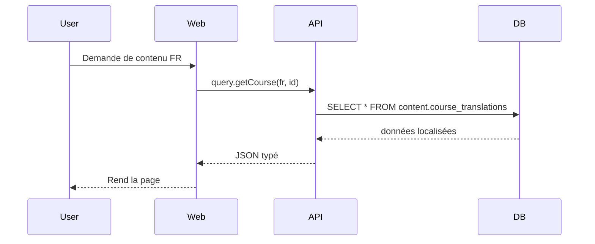
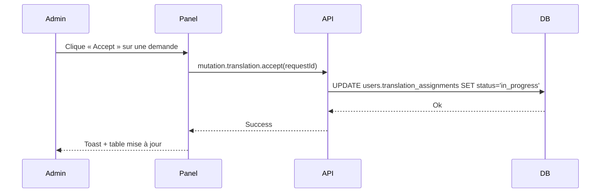

# Bitcoin Learning Management System (BLMS)

Bienvenue sur la page de présentation du **Bitcoin Learning Management System** (BLMS). Ce document résume, en français simple, les technologies employées et le fonctionnement global de la plateforme afin que vous puissiez rapidement comprendre la valeur du projet.

---

## 1. Pourquoi BLMS ?

L’objectif est de proposer un **écosystème complet d’apprentissage** dédié à Bitcoin : cours interactifs, ressources, traductions collaboratives et suivi précis de la progression des apprenants.

---

## 2. Vue d’ensemble de l’architecture

```
Monorepo (pnpm workspaces)
├─ apps/
│  ├─ web/         → Site principal pour les étudiants
│  ├─ contribute/  → Plate-forme des contributeurs & traducteurs
│  └─ api/         → Backend tRPC (Node.js)
├─ packages/
│  ├─ ui/          → Librairie de composants React + Tailwind
│  ├─ service-content/  → Logique métier des contenus
│  ├─ database/    → Modèles & migrations Drizzle ORM (PostgreSQL)
│  └─ …            → Types partagés, constantes, utilitaires
└─ docs/           → Documentation
```

* **Monorepo** : un seul dépôt, facilité de partage de code.
* **Séparation claire** entre interface utilisateur, logique métier et accès aux données.

---

## 3. Principales technologies

| Domaine | Stack | Raisons du choix |
|---------|-------|------------------|
| Frontend | **React 18**, **TypeScript**, **TanStack Router & Query**, **TailwindCSS**, **Vite** | Rapidité de développement, typage strict, expérience utilisateur fluide. |
| Backend  | **Node.js (ESM)**, **tRPC** | API 100 % typesafe de bout en bout, sans code dupliqué. |
| Base de données | **PostgreSQL** + **Drizzle ORM** | Schemas versionnés, requêtes typées, migrations automatiques. |
| DevOps | **Docker**, **TurboRepo**, **pnpm** | Déploiements reproductibles, builds parallélisés, gestion efficace des dépendances. |
| Tests & Qualité | **Biome (lint/format)**, **Vitest**, CI GitHub Actions | Code propre, fiable et vérifiable en continu. |
| Internationalisation | **i18next** | Basculer de langue instantanément dans toute l’appli. |

---

## 4. Fonctionnement global

1. **Gestion des contenus** dans le schéma `content` de la base : cours, chapitres, ressources.
2. **Gestion des utilisateurs** dans le schéma `users` : comptes, permissions, progression.
3. **Panel d’administration & traduction** (Contribute App) :
   * Attribution de cours / chapitres aux traducteurs.
   * Suivi en temps réel des demandes, avancement et validations.
   * Workflows multi-niveau (reviewer & super reviewer).
4. **Site Web principal** (Web App) :
   * Parcours d’apprentissage interactif avec suivi de progression.
   * Contenus rendus dynamiquement en fonction de la langue.
5. **API tRPC** : point central qui relie les deux interfaces et garantit la cohérence des types.

Schéma simplifié du flux :



---

## 5. Modules clés

### 5.1 UI / Design System

* Composants atomiques réutilisables (`@blms/ui`).
* Thème Tailwind personnalisable (mode clair/sombre).

### 5.2 Service-Content

* Méthodes métier pour créer, valider et publier des traductions.
* Calcul de la progression d’un cours.

### 5.3 Translation Panel

* Acceptation / Rejet de demandes.
* Onglet **Translate** : import de fichiers Markdown ou ZIP, détection automatique des langues manquantes.
* Onglet **Content Management** : vue globale des traductions actives.
* Rapports téléchargeables (CSV).

#### Fonctionnalités clés

| Catégorie | Détails |
|-----------|---------|
| Gestion des demandes | Compteur temps-réel, recherche full-text, acceptation ou rejet (avec motif) des demandes de traduction. |
| Translate | Sélection des langues manquantes, upload dossier/ZIP ou URL Git, validation de la structure des fichiers, création des entrées de traduction dans la DB. |
| Content Management | Tableau filtrable (cours, langue, statut, contributeur) avec barre de progression et assignation manuelle ou ré-assignation. |
| User Management | Profil contributeur, historique des assignments, assignation directe d’un nouveau cours. |
| Rapports | Filtres date/année, export CSV, KPI (chapitres validés, temps moyen de review, top contributeurs). |
| UX | Persist des filtres, raccourcis clavier (Ctrl+F), responsive design et conformité WCAG 2.1. |

#### Flux de travail simplifié



#### Pourquoi c’est important ?

1. **Centralisation** : toutes les opérations de traduction dans une seule interface.
2. **Qualité** : workflow reviewer/super-reviewer assurant plusieurs niveaux de validation.
3. **Scalabilité linguistique** : ajout rapide de nouvelles langues grâce à l’onglet Translate.
4. **Productivité** : assignations en un clic, suivi visuel de la progression.
5. **Traçabilité** : historique complet des actions stocké dans `users.translation_assignments`.

---

## 6. Sécurité & Qualité

* Authentification basée sur **sessions chiffrées**.
* **Permissions fines** (admin, contribute:assign, reviewer, etc.).
* Validation des entrées avec **Zod** côté serveur et côté client.
* Couverture de tests unitaires & intégration.

---

## 7. Pourquoi c’est intéressant ?

* **Typesafe de bout en bout** : moins d’erreurs entre frontend et backend.
* **Scalabilité** : architecture modulaire, chaque package peut évoluer indépendamment.
* **Ouverture internationale** : système de traduction intégré avec workflows de validation.
* **Expérience développeur** optimale grâce à Vite, TurboRepo et Docker.

---

## 8. Services proposés

| Service | Description | Valeur ajoutée |
|---------|-------------|----------------|
| **Audit d’architecture** | Analyse complète de votre stack actuelle (code, infra, données) avec rapport détaillé et recommandations. | Identifie les goulets d’étranglement et réduit les coûts techniques. |
| **Développement clé-en-main** | Conception, réalisation et déploiement d’applications web / mobile sur mesure basées sur les meilleures pratiques BLMS. | Time-to-market rapide grâce à notre bibliothèque de composants et à l’architecture monorepo. |
| **Migration vers TypeScript & monorepo** | Passage progressif d’un codebase JavaScript ou poly-repo vers un environnement TypeScript, pnpm workspaces, TurboRepo. | Sécurité de typage, duplication minimisée, intégration CI/CD simplifiée. |
| **Internationalisation & Localisation** | Mise en place de pipelines i18n, workflows de traduction (comme le Translation Panel), et déploiement multilingue. | Augmente votre portée globale sans sacrifier la qualité. |
| **DevOps & Cloud** | Containerisation Docker, orchestration, CI GitHub Actions, monitoring (Grafana/Prometheus). | Déploiements reproductibles et observabilité de bout en bout. |
| **Formation & Coaching** | Ateliers pratiques sur React, TypeScript, tRPC, Drizzle, tests et Clean Code. | Monte en compétence vos équipes internes. |

## 9. Méthodologie & Processus

1. **Découverte & cadrage** – Atelier pour définir objectifs, personas, KPIs.
2. **Architecture design** – Diagrammes C4, choix technologiques, POC rapide si besoin.
3. **Sprints agiles** – Itérations de 2 semaines, démonstrations et feedback continus.
4. **Qualité intégrée** – TDD / Vitest, revues de code systématiques, linting Biome, scans SCA.
5. **CI/CD automatisé** – Build, tests, analyse de couverture, déploiement sur environnement staging puis production.
6. **Mesure & optimisation** – Suivi métriques (Lighthouse, Core Web Vitals, DB perf), amélioration continue.

## 10. Performance & Scalabilité

* **Caching** : utilisation de TanStack Query + headers HTTP + CDN pour réduire la latence.
* **Base de données** : indexations adaptées, partitionnement, requêtes typées Drizzle.
* **Asynchrone** : files de messages (RabbitMQ/SQS) pour tâches lourdes (render PDF, envoi email).
* **Observabilité** : logs structurés, alerting Prometheus, traces OpenTelemetry.

## 11. Support & Maintenance

* **SLA** jusqu’à 99,9 % de disponibilité.
* **Mises à jour de sécurité** dans les 24 h.
* **Roadmap partagée** et sessions Q&A hebdomadaires.


