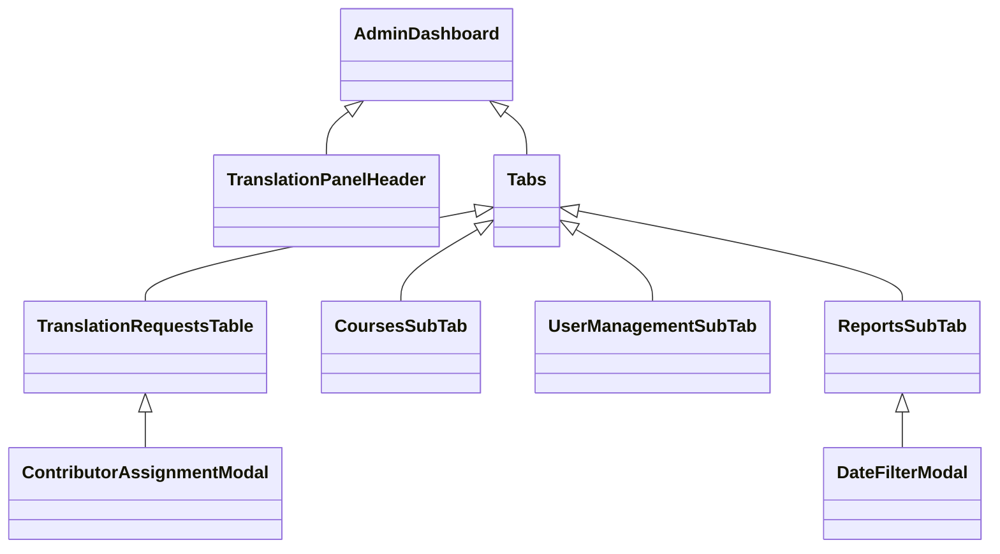
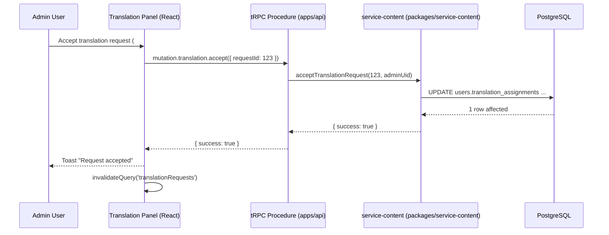
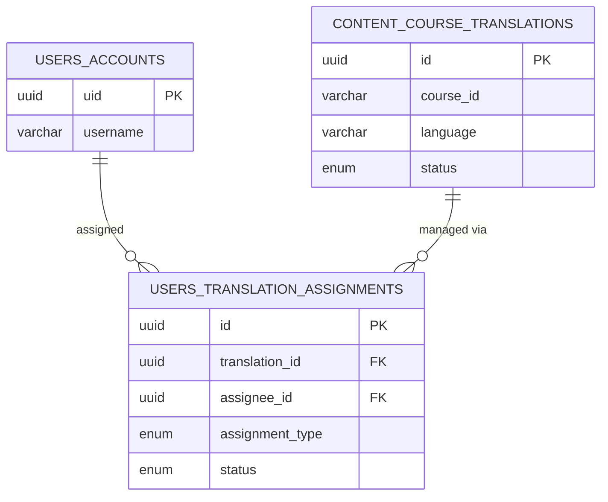

# Translation Panel Documentation

> **Scope**: Admin dashboard section for managing course translations and contributor assignments across the Bitcoin Learning Management System.

---

## 1. Purpose & Audience

The Translation Panel is a dedicated interface for **administrators** and **project managers** to:

1. Review and process translation *requests* from contributors.
2. Assign or re-assign courses (or individual chapters) to contributors.
3. Track translation progress and quality through multi-level review workflows.
4. Generate reports for stakeholder review.

This document helps **backend**, **frontend**, and **product** teams understand how the panel works end-to-end.

---

## 2. Functional Overview

### Core Capabilities

| Capability | Description |
|------------|-------------|
| Pending Requests | Accept / reject contributor translation requests with optional rejection reason. |
| Rejected Requests | Audit trail of previously rejected requests with quick *Restore* action. |
| Content Management | Overview of **all active translations** by course & language. Supports filtering, manual assignment, and progress monitoring. |
| User Management | View contributor profile, languages, current assignments, and historical performance. Supports direct assignment from user details page. |
| Reports | Exportable CSV/JSON reports filtered by year/month for translation KPIs (e.g. completed chapters, average time-to-review). |

> All views are internationalised via i18next and inherit design tokens from the shared `@blms/ui` package.

---

## 3. UI Architecture

### Component Hierarchy



### Route Structure

```
apps/web/src/routes/$lang/dashboard/_dashboard/administration/
├── translation-panel/
│   ├── index.tsx                 # Router entry, renders <DashboardAdministrationTranslationPanel/>
│   ├── user/$userId.tsx          # Contributor details page
│   ├── course/$courseId.tsx      # Course translation details page
│   └── -components/
│       ├── translation-panel-header.tsx
│       ├── translation-requests-table.tsx
│       ├── contributor-assignment-modal.tsx
│       ├── courses-sub-tab.tsx
│       └── date-filter-modal.tsx
└── other admin components...
```

---

## 4. State Management & Data Flow

### Global State

* **React Context**: `AppContextProvider` provides session & permissions – used by header and auth guards.
* **TanStack Query**: Handles server state (**tRPC**) with caching & automatic refetch on mutation success.
* **Zustand** (local): Tiny slice inside `useTranslationPanelStore.ts` (⚠ *future refactor*) to keep tab & filter state when navigating deep links.

### Sequence Diagram



---

## 5. Backend Integration

| Procedure | Path | Permission | Description |
|-----------|------|------------|-------------|
| `translation.listRequests` | `apps/api/src/routers/content/translations.ts` | `contribute:assign` | Paginated list of pending/rejected requests. |
| `translation.acceptRequest` | idem | `contribute:assign` | Marks request **accepted**, creates `translation_assignments` row. |
| `translation.rejectRequest` | idem | `contribute:assign` | Marks request **rejected**, records `reason`. |
| `translation.assignContributor` | idem | `contribute:assign` | Manual assignment flow from *Content* or *User* tab. |
| `translation.reassignContributor` | idem | `contribute:assign` | Re-assignment with history preservation. |
| `translation.courseDetails` | idem | `contribute:assign`/`contribute:reviewer` | Progress & chapter-level statuses. |

> All procedures are wrapped in `protectedProcedure` which enforces session & permission checks.

---

## 6. Database Touchpoints

The panel surfaces data from the following tables (see `docs/contribute-app-data-architecture.md` for full DDL):

* `content.course_translations`
* `content.course_translation_chapters`
* `users.translation_assignments`
* `users.translation_chapter_assignments`
* `users.translation_reviews`

### Simplified ERD (translation stewarding subset)



---

## 7. Feature Catalogue

Below is an exhaustive list of **current, production-ready features** exposed by the Translation Panel.

### 7.1 Request Management (Pending / Rejected Tabs)

* **Real-time Counters** — Badges display the total number of pending and rejected requests (auto-refresh every 30 s).
* **Search & Filter** — Full-text search on contributor username, course index, course name and language. Toggle to switch between *Pending* and *Rejected* scopes.
* **Accept Workflow** — One-click accept with confirmation modal; on success a toast is displayed and TanStack Query cache is invalidated.
* **Reject Workflow** — Two-step modal requiring a rejection reason ≥ 10 chars (validated client-side). Reason is persisted to `users.translation_assignments.status` (set to `rejected`).
* **Re-Evaluate** — From the *Rejected* tab admins can “Restore” a request, sending it back to *Pending*.
* **Pagination** — Infinite-scroll table (intersection-observer) loading 50 requests per page.

### 7.2 Translate Tab

* **Course Explorer** — Displays every course that still has *todo* translations. Each row shows index, name, number of missing languages, and total available languages.
* **Sorting** — Columns sortable by index, course name, todo count, total languages.
* **Search** — Instant client-side search across course index, name and language codes.
* **Translate Action** — Clicking *Translate* opens the *Select Languages Modal* where admin can:
  * Pick one or many languages still missing.
  * Upload a folder (drag-drop) or ZIP containing Markdown files *or* provide a remote GitHub/GitLab URL.
  * Optionally leverage existing English translation as source if original language ≠ EN.
* **Validation** — Client-side file structure validation (must match `/part-{n}/chapter-{m}.md`), language code checks.
* **Overwrite Detection** — The modal warns if uploads already exist and prompts confirmation before overwrite.
* **Start Translation** — On success, creates/updates `content.course_translations` rows and associated `users.translation_assignments` entries with status `in_progress`.

### 7.3 Content Management Tab

* **Course Grid** — Lazy-loaded table listing every active `course_translations` row with columns: index, course name, language, contributor, progress %, status, last updated.
* **Advanced Filters** — By course, by language, by status (`pending | in_progress | under_review | validated`), by contributor.
* **Column Sorting** — Sort by progress, course index or last updated.
* **Manual Assignment** — “Assign / Reassign” button opens *Contributor Assignment Modal* (see 7.5).
* **Progress Bar** — Visual indicator computed as `validated_chapters / total_chapters`.
* **Deep Link** — Clicking a row navigates to `/course/$courseId` detail page, preserving filters via URL search params.

### 7.4 Course Detail View

* **Contributor Snapshot** — Shows current assignee with avatar, username, languages.
* **Chapter Tree** — Accordion per part ➜ nested chapters renderer with status icon (colour-coded).
* **Inline Actions** — For each chapter admin can mark **validated** or **needs_changes** (writes to `course_translation_chapters.status`).
* **Statistics Sidebar** — Aggregates completed chapters, remaining chapters, validation ratio.

### 7.5 User Management Tab

* **Contributors Table** — Lists all users having `contributor` role with metrics: assigned courses, languages, overall progress.
* **Search & Filter** — By username and languages (multi-select).
* **Contributor Detail Page** — `/user/$userId` exposing:
  * Personal info & language proficiencies
  * Active assignments list with progress bars
  * Historical assignments (completed / rejected)
  * Quick actions: *Assign new course*, *Message via Telegram* (if available)

### 7.6 Contributor Assignment Modal

* **User Search** — Debounced search on `users.accounts.username` & `displayName`.
* **Language Selector** — Multi-select limited to languages where translation does not yet exist for the course.
* **Validation** — Prevents duplicate assignments and informs admin when user lacks proficiency in selected language.
* **Batch Assignment** — Supports assigning multiple contributors-language pairs before submitting.

### 7.7 Reports Tab

* **Date Range Picker** — Year selector + optional from-month / to-month modal.
* **KPIs Displayed** —
  * Courses translated / validated
  * Chapters completed
  * Average time from assignment → validation
  * Top contributors by completed translations
* **Download** — Exports the filtered report to CSV (server-side streaming for large datasets).

### 7.8 Navigation & UX Enhancements

* **Tab Persistence** — Selected tab & filters are stored in `sessionStorage` to survive page refresh.
* **Keyboard Shortcuts** — `Ctrl+F` focuses the search bar inside current tab.
* **Responsive Design** — Breakpoints handled via shared Tailwind mixins; tables become stacked cards on < md screens.
* **Accessibility** — All interactive elements meet WCAG 2.1 AA: focus styles, ARIA labels, proper heading hierarchy.

### 7.9 Internationalisation

* Translation keys follow pattern `dashboard.adminPanel.translationPanel.*` present in `apps/web/public/locales/*`.
* Fallback language: English → French.

---

## 8. Extensibility & Roadmap

1. **Bulk actions** for request processing.
2. **Analytics dashboard** with charts (translation velocity, avg. review time).
3. **Notification hooks** (email / in-app) when status changes.
4. **Role-based tabs** – hide irrelevant tabs for non-admin users.

---

## 9. Local Development Tips

```bash
# Start web app in watch mode
pnpm --filter @blms/web dev

# Visit
http://localhost:5173/{lang}/dashboard/administration/translation-panel
```

---

## 10. Related Documents

* [Contribute App Data Architecture](./contribute-app-data-architecture.md)
* [Contribute App Implementation](./contribute-app-implementation.md)
* [Data Architecture](./data-architecture.md)
